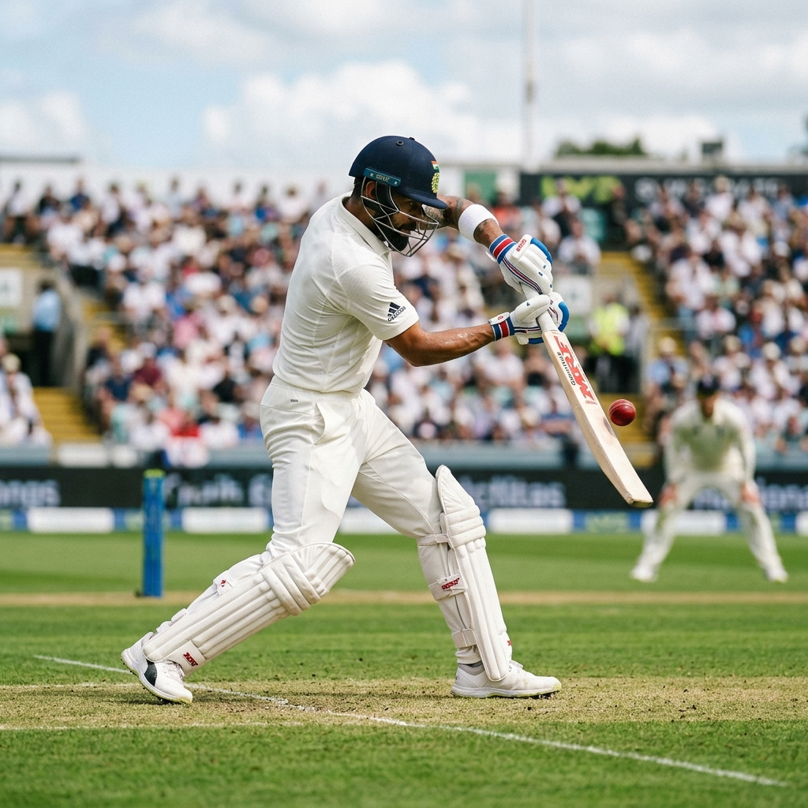

# 🏏 Cricket Shadow Coach

**Real-time AI cricket technique analysis in your browser — score your batting strokes and screen your bowling action against the ICC 15° elbow-extension guideline, using nothing but a webcam.**

🔗 **Live:** https://www.cricketcoach.online



> The live view overlays a real-time skeleton on your camera feed and streams joint
> telemetry as you move. (Add a `docs/skeleton-overlay.gif` here to show it in motion.)

---

## Features

- **5 batting drills** — cover drive, straight drive, pull shot, defensive block, flick shot — each scored against a biomechanically-authored ideal model via Dynamic Time Warping.
- **ICC bowling action screen** — an *indicative* elbow-extension check against the 15° Rule 11.1 guideline, with honest 2D-camera caveats (see [Limitations](#accuracy--limitations)).
- **Hands-free auto-record** — stand in your stance and the app detects stability, counts you down, records the shot, and analyses the follow-through automatically.
- **Live skeleton overlay + telemetry** — real-time joint angles (elbows, knees, spine tilt) with a ghost blueprint to align your stance.
- **Left / right-handed support** — the ideal model mirrors for left-handers.
- **Runs in-browser** — MediaPipe Pose executes on-device; your video never leaves your machine.
- **Installable PWA** — offline app-shell, add-to-home-screen.

## Architecture

```
┌─────────────────────────── Browser (on-device) ───────────────────────────┐
│                                                                            │
│  Webcam ─▶ MediaPipe Pose ─▶ 2D + 3D world landmarks ─▶ Canvas skeleton    │
│                                    │                                       │
│                                    ▼                                       │
│                       33 joint coords / frame (no video)                   │
└────────────────────────────────────┬───────────────────────────────────────┘
                                      │  POST /api/analyze-shot
                                      ▼
┌──────────────────────────── FastAPI backend ───────────────────────────────┐
│  extract angles ─▶ visibility gate ─▶ smooth ─▶ resample(50) ─▶ DTW vs ideal │
│  ─▶ blend with motion/stance quality ─▶ score + coaching feedback           │
└─────────────────────────────────────────────────────────────────────────────┘
```

**Stack:** React 19 + Vite (frontend, Vercel) · FastAPI (serverless on Vercel, or containerised on Render/Fly) · MediaPipe Pose (in-browser) · fastdtw + NumPy/SciPy scoring.

## Quickstart (local dev)

**Frontend**
```bash
npm install
npm run dev        # http://localhost:5173  (proxies /api to :8000)
```

**Backend**
```bash
cd api
python -m venv .venv && source .venv/bin/activate
pip install -r requirements.txt          # or requirements-full.txt for ball tracking
uvicorn index:app --reload --port 8000
```

**Tests**
```bash
npm test                        # frontend smoke test (vitest)
cd api && python -m pytest tests -q
python -m eval.run_eval         # scoring calibration harness
```

## Accuracy & Limitations

The scorer is calibrated with a synthetic eval harness (`api/eval/`). Current results:

| Case | Score | Target |
|------|------:|:------:|
| Ideal replay (all 5 shots) | 95–99 | ≥ 90 |
| Time-stretched ideal (0.5×–2×) | 97–100 | ≥ 85 |
| Noisy ideal (±3° jitter) | 98 | ≥ 75 |
| Sitting still | 5 | ≤ 30 |
| Random flailing | 7 | ≤ 30 |

Run `python -m eval.run_eval` from `api/` to reproduce.

**Bowling legality is an indicative screen, not an official verdict.** A single 2D
camera cannot match lab-grade 3D motion capture: elbow extension is defined in the
arm's plane, but a webcam measures it in the image plane, and perspective
foreshortening can add or remove tens of degrees. The app labels results as
"likely legal / possible throw (indicative)", surfaces a disclaimer, and warns when
you're filmed side-on (where the read is least reliable). Film front-on or at ~45°.

Batting scores also degrade when landmarks aren't well tracked; the response
reports a **tracking-quality** percentage and the UI warns below 60%.

## Deployment

- **Frontend:** Vercel (`vercel.json` — SPA rewrite + `/api/*` → `api/index.py`).
- **Backend (serverless):** Vercel Python function. Ball tracking is disabled here
  (returns 501) since opencv/ultralytics are too large for serverless.
- **Backend (container):** `api/Dockerfile` / `render.yaml` / `api/fly.toml` install
  `requirements-full.txt` and set `ENABLE_BALL_TRACKING=true` so `/api/track-ball` works.

The bowling-action training script (`api/train_action_model.py`) produces a
`bowling_model.pt`; it is a research artifact not used at runtime and is **not**
tracked in git (attach it to a GitHub Release if needed).

## Documentation

- [docs/ARCHITECTURE.md](docs/ARCHITECTURE.md) — system design & algorithms
- [docs/API_REFERENCE.md](docs/API_REFERENCE.md) — endpoint reference
- [docs/DEPLOYMENT.md](docs/DEPLOYMENT.md) — production deployment
- [docs/INDEX.md](docs/INDEX.md) — full docs table of contents

## License

MIT © 2026 Bilal Hasan
